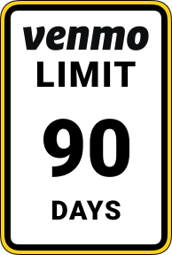
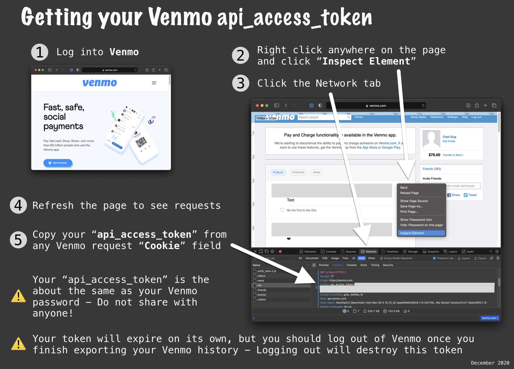

# 📜 Venmo History CSV



**Venmo** has a tool for exporting your history as CSV, but limits it to 90 days at a time.

> Note: All of your transaction history can be viewed, but you can only view or download a maximum of 90 days at one time...
> [Venmo history help article](https://help.venmo.com/hc/en-us/articles/360016096974-Transaction-History)

With **`Venmo History CSV`** you can export all of your Venmo history to a single file.

## **Usage**

```
Usage: ruby venmo_history.rb [OPTIONS]

    🗃  Export all of your venmo history to CSV.
    💻 Developed by Avery Ryder -> (Github: ryderpro)

Required Options:
  -d, -date [2018-01-01]     fetch transactions from now to past date
  -t, -access_token [TOKEN]  access token to use Venmo API

 More Options:
  -b, -before_id [id]        Start after specific transaction_id
  -help, -h                  show this message and exit
```

## **Instructions**

1. You'll need to have or install Ruby and [`Bundler`](https://bundler.io). Bundler allows loading dependencies when you execute a file with `require 'bundler/inline'`.

2. Get your api_access_token by logging into Venmo through any browser.

   

3. Save this script, `venmo_history.rb`, locally and run this command to get all venmo transactions from now to 2018-01-01.  
   `$ ruby venmo_history.rb -d 2018-01-01 -t accesstoken`

4. Say you want to pick up where you left off an a specific transaction with id (`987654321`) do this command.
   `$ ruby venmo_history.rb -d 2018-01-01 -t accesstoken -b 987654321`

## **What to expect**

```
ruby venmo_history.rb -t great-token-12345 -d 2017-01-01

💎 Getting ready to fetch Venmos from now back to 2017-01-01...

🐕 Fetching me with {}... 200 OK
🐕🐕🐕 Retrieved 19 records.

💎 Found username - ryderpro

🐕 Fetching stories/target-or-actor/123456 with {:limit=>50}... 200 OK
🐕🐕🐕 Retrieved 50 records.

🐕 Fetching stories/target-or-actor/123456 with {:limit=>50, :before_id=>"309638417"}... 200 OK
🐕🐕🐕 Retrieved 50 records.

🐕 Fetching stories/target-or-actor/123456 with {:limit=>50, :before_id=>"304335560"}... 200 OK
🐕🐕🐕 Retrieved 50 records.

🐕 Fetching stories/target-or-actor/123456 with {:limit=>50, :before_id=>"215903083"}... 200 OK
🐕🐕🐕 Retrieved 50 records.

Continues fetching.....

💎 Exporting 1083 transactions. Look for venmos_120820_to_010417.csv.
✅ Finished.

🔨🔨🔨🔨🔨🔨🔨🔨🔨🔨🔨🔨🔨🔨🔨🔨🔨🔨🔨🔨🔨🔨🔨🔨🔨
```

## **Acknowledgements**

- [Rossta's Blog on paginated resources](https://rossta.net/blog/paginated-resources-in-ruby.html) was a very helpful starting place for this work.

## **Disclaimer**

I was able to export all my history, December 2020 to January 2015, 1500+ transactions, without any issues. The private endpoint being used `stories/` is the suggested way to traverse your account history.

I expected a rate limit, or some other API Error while testing this script but encountered none.

The code within this repository comes with no guarantee, the use of this code is your responsibility.

I take NO responsibility and/or liability for how you choose to use any of the source code available here. By using any of the files available in this repository, you understand that you are AGREEING TO USE AT YOUR OWN RISK. Once again, ALL files available here are for EDUCATION and/or RESEARCH purposes ONLY.

Misuse of your Venmo access token could result in your account being locked or other actions from Venmo.
